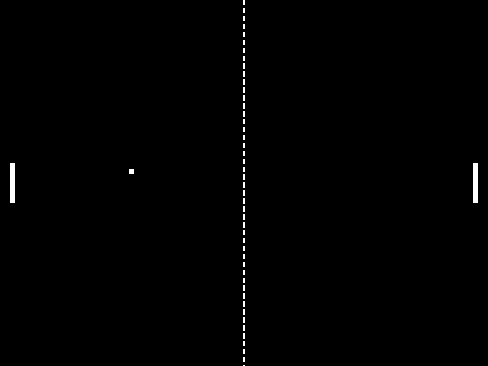

# Pong
Revolutionary game Pong remade in C programming language.

## Checklist
- [x] ball translation
- [x] ball collision
- [x] player collision
- [x] player control
- [x] ball reset
- [ ] score system

## Dependencies
- [SDL](https://github.com/libsdl-org/SDL/releases/latest)

## Building
- Run the Makefile included in the project using `$ make`.
- The executable, once built, can be found in `./out/`.
